# 题目分类及刷题顺序推荐

## 一 数组
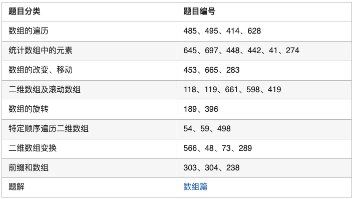

## 二 字符串
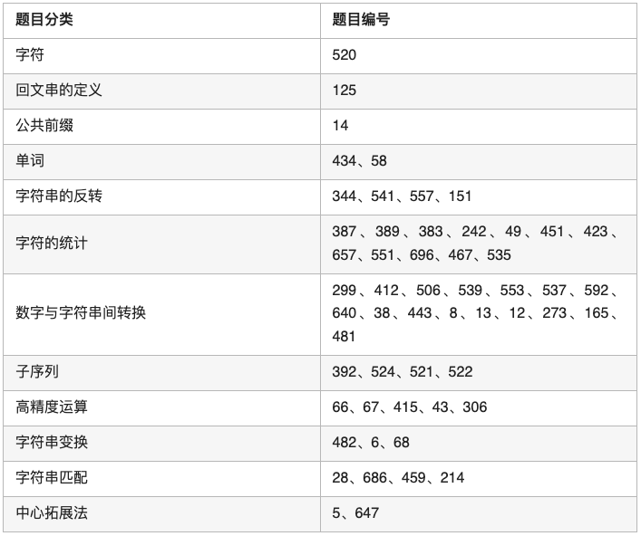

## 三 数与位
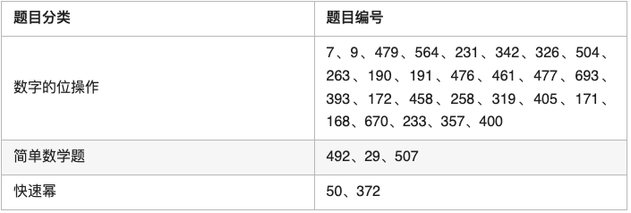

## 四 栈与递归
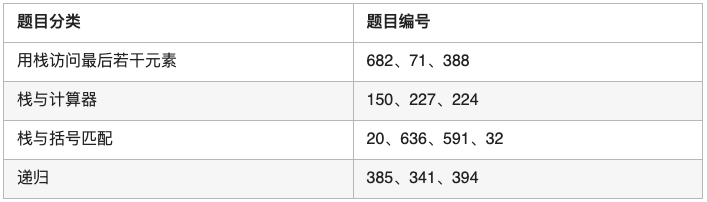

## 五 链表
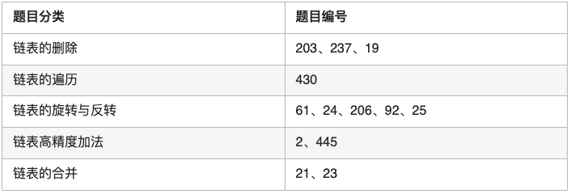

## 六 哈希表
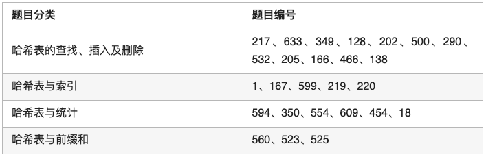

## 七 贪心算法
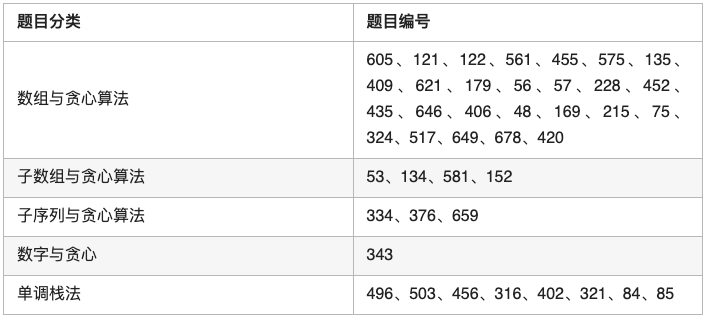

## 八 双指针法
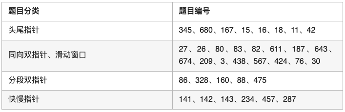

## 九 树
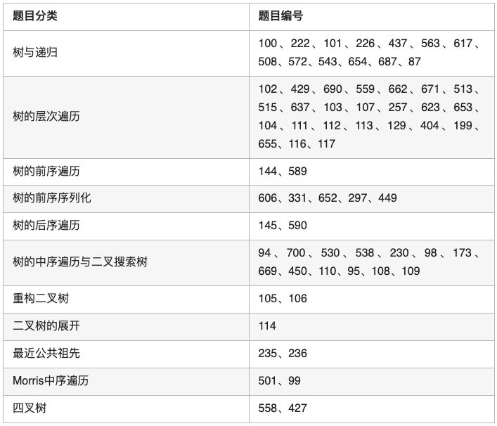

## 十 图与搜索
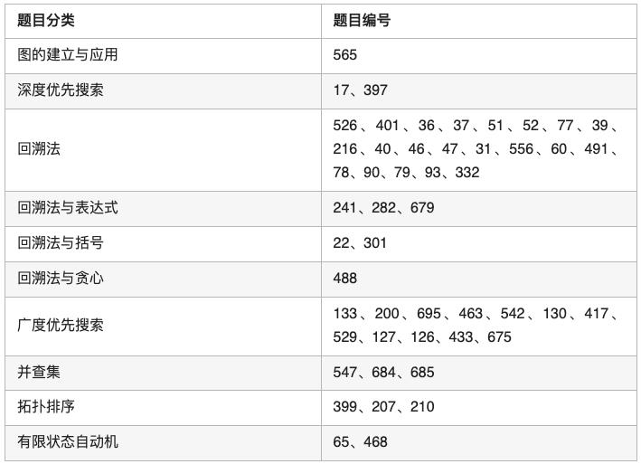

## 十一 二分查找
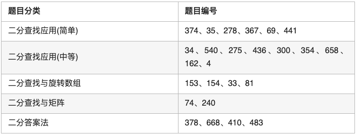

## 十二 二进制运算的应用
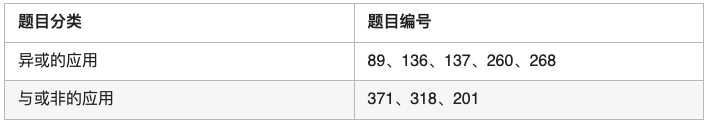

## 十三 动态规划
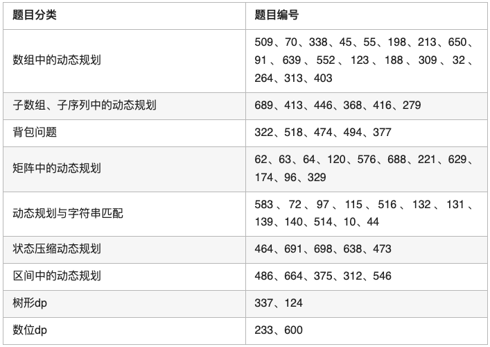

## 十四 数据结构
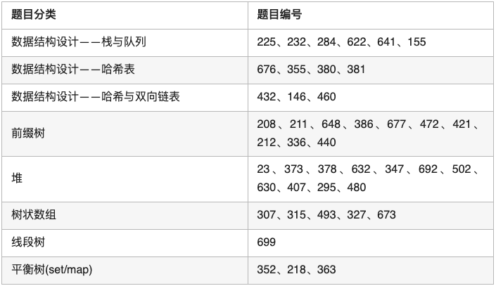

## 十五 采样

## 十六 计算几何
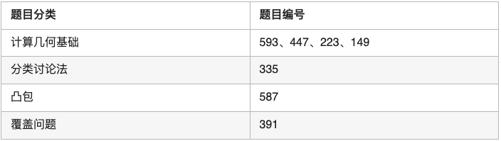

## 十七 常用技巧与算法
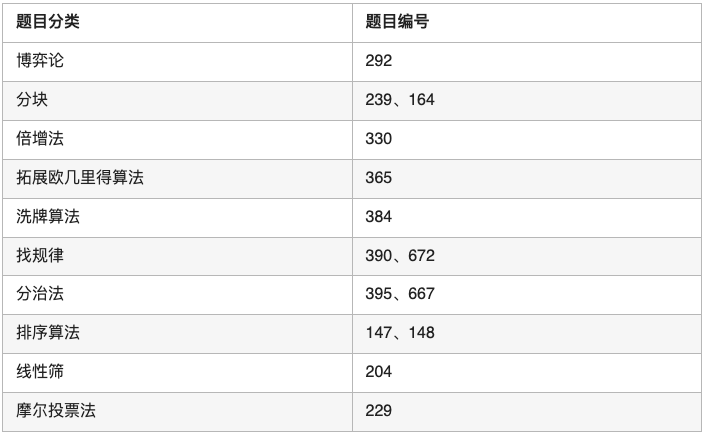
