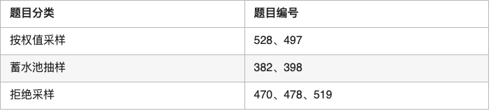

# 题目分类及刷题顺序推荐

## 一 数组

## 二 字符串

## 三 数与位

## 四 栈与递归

## 五 链表

## 六 哈希表

## 七 贪心算法

## 八 双指针法

## 九 树

## 十 图与搜索

## 十一 二分查找

## 十二 二进制运算的应用

## 十三 动态规划

## 十四 数据结构

## 十五 采样

## 十六 计算几何

## 十七 常用技巧与算法

